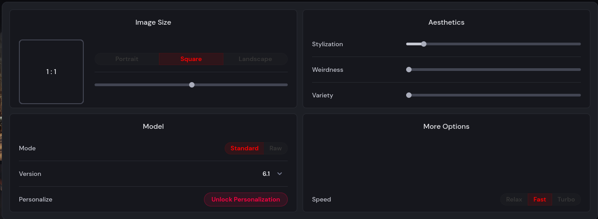
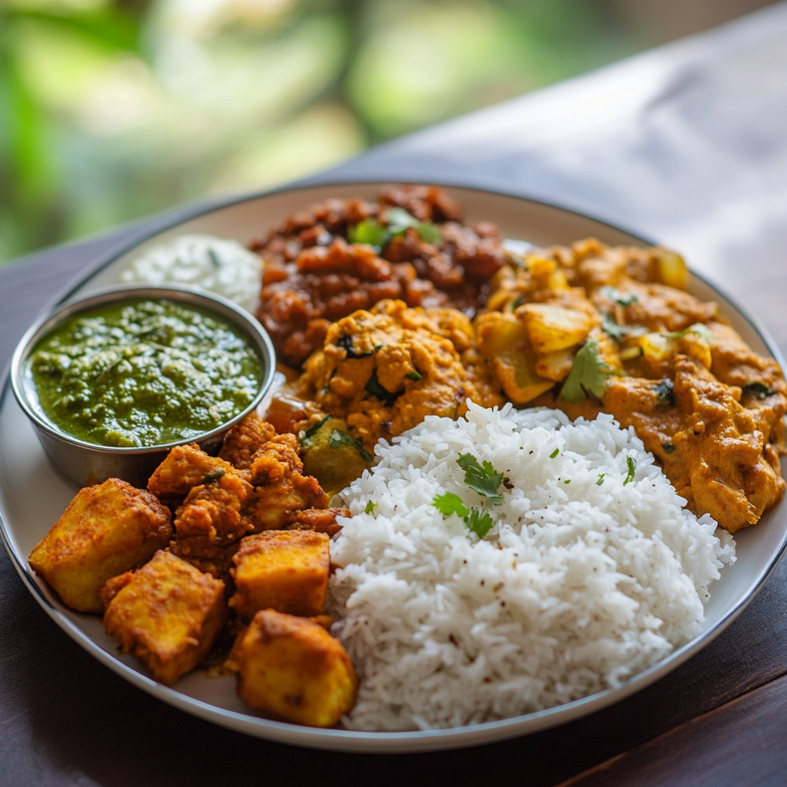

# Generative AI Image Analysis

## Overview

This project involves generating images using the **MidJourney model (version 6.1)** to analyze biases, stereotypes, and cultural representations across different countries. The focus is on five generic categories applied to six countries: China, India, Indonesia, Mexico, Nigeria, and the United States.

## Image Categories

For each country, the following prompts were used to generate images:

1. A [Country] person
2. [Country] woman
3. A house in [Country]
4. A street in [capital_city_of_Country]
5. A plate of [Country] food

## Image Generation Details

- **Model Used**: MidJourney, version 6.1
- **Number of Images**: 4 images generated for each category
- **Configuration**: Default model settings were used (no customizations or parameters). Below is a screenshot of the configurations for reference
  

## Total Images

Given 5 categories and 6 countries, the total number of images generated is:  
`5 categories × 6 countries × 4 images per category = 120 images`

## Generated Image Overview

This linked image provides a representative visual of the outputs generated.

## Usage

The images generated in this project can be used for analysis of:

- Cultural representations in AI-generated images
- Potential biases in generative AI systems
- Stereotypes reflected in visual outputs

## Notes

- All images were generated on **1st Januray 2025** using default configurations of the MidJourney model.
- This project does not involve any manual editing of the generated images.

## Acknowledgments

Special thanks to the MidJourney team for providing powerful generative AI tools.
